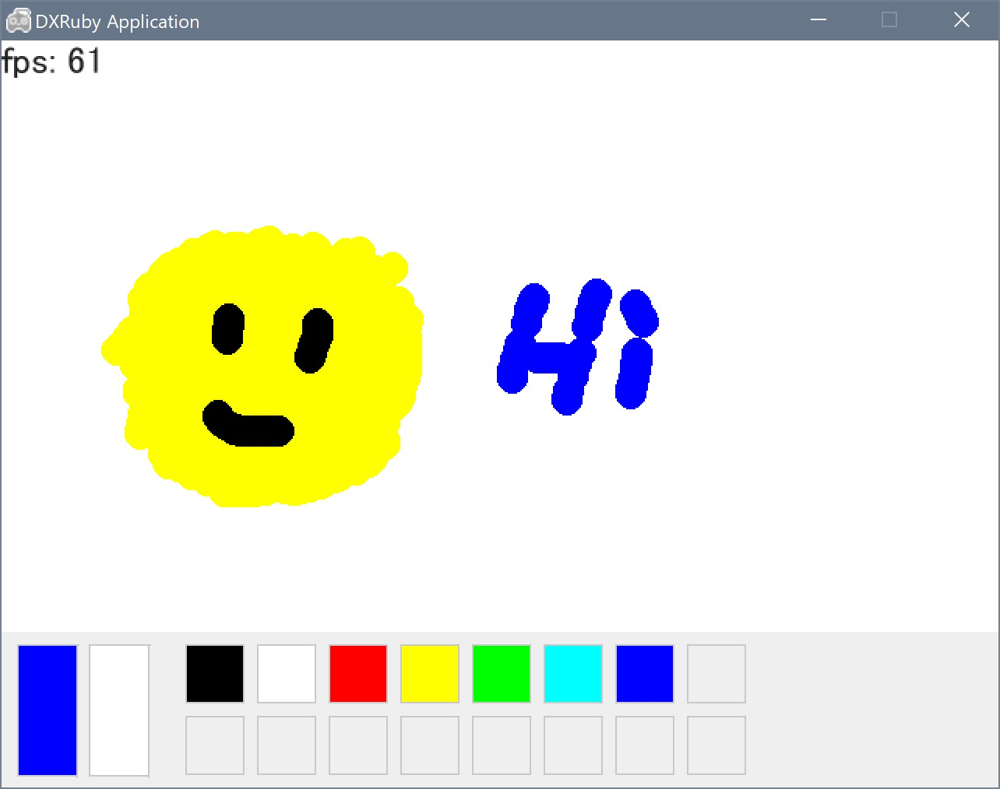

# dxruby-paint
simple paint app with dxruby



## Play on your PC
```bash
gem install dxruby
ruby app.rb
```

## Play at browser (WIP)
https://stonesaw.github.io/dxruby-paint


### Build to browser app (WIP)
```bash
gem install dxopal
cd docs
dxopal serve
```
